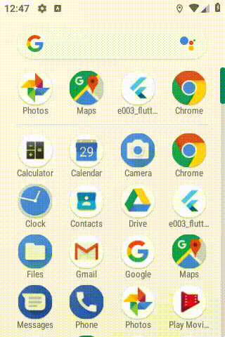
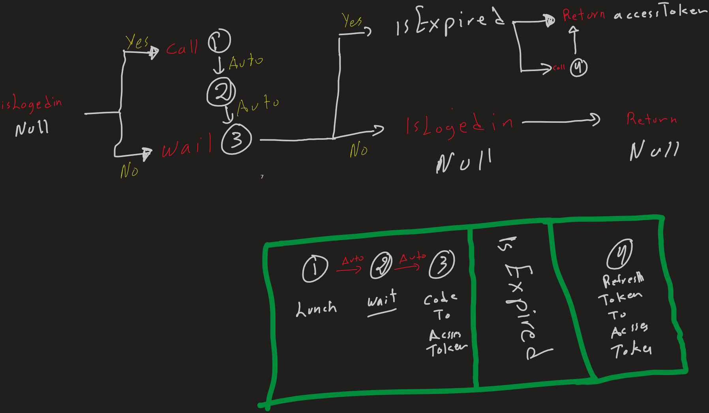

# e003_flutter_listview_crud_app_using_oauth2_secure_rest_api

## Screen Record

## What

- flutter Task app using oauth2 secure rest api

- must run with :

  - [elrashid-flutter-examples/e001-aspcore-identity-server-for-flutter](https://github.com/elrashid-flutter-examples/e001-aspcore-identity-server-for-flutter)

  - [elrashid-flutter-examples/e002s-aspcore-rest-api-server-for-flutter-secure](https://github.com/elrashid-flutter-examples/e002s-aspcore-rest-api-server-for-flutter-secure)

## Login logical Diagram

## Step 1

add the flowing dependencies to pubspec.yaml

      crypto: any
      url_launcher: any
      uni_links: any
      http: any

## Step 2

open

    \android\app\src\main\AndroidManifest.xml

affter :

    <intent-filter>
        <action android:name="android.intent.action.MAIN"/>
        <category android:name="android.intent.category.LAUNCHER"/>
    </intent-filter>

add

    <intent-filter>
        <action android:name="android.intent.action.VIEW"/>
        <category android:name="android.intent.category.DEFAULT" />
        <category android:name="android.intent.category.BROWSABLE" />
        <!-- Custom Path data -->
        <data android:path="/auth" android:scheme="com.googleusercontent.apps.932931520457-buv2dnhgo7jjjjv5fckqltn367psbrlb"/>
    </intent-filter>

full code

    <manifest xmlns:android="http://schemas.android.com/apk/res/android"
        package="com.example.e003_flutter_listview_crud_app_using_oauth2_secure_rest_api">

        <!-- io.flutter.app.FlutterApplication is an android.app.Application that
            calls FlutterMain.startInitialization(this); in its onCreate method.
            In most cases you can leave this as-is, but you if you want to provide
            additional functionality it is fine to subclass or reimplement
            FlutterApplication and put your custom class here. -->
        <application
            android:name="io.flutter.app.FlutterApplication"
            android:label="e003_flutter_listview_crud_app_using_oauth2_secure_rest_api"
            android:icon="@mipmap/ic_launcher">
            <activity
                android:name=".MainActivity"
                android:launchMode="singleTop"
                android:theme="@style/LaunchTheme"
                android:configChanges="orientation|keyboardHidden|keyboard|screenSize|locale|layoutDirection|fontScale|screenLayout|density|uiMode"
                android:hardwareAccelerated="true"
                android:windowSoftInputMode="adjustResize">
                <!-- This keeps the window background of the activity showing
                    until Flutter renders its first frame. It can be removed if
                    there is no splash screen (such as the default splash screen
                    defined in @style/LaunchTheme). -->
                <meta-data
                    android:name="io.flutter.app.android.SplashScreenUntilFirstFrame"
                    android:value="true" />
                <intent-filter>
                    <action android:name="android.intent.action.MAIN"/>
                    <category android:name="android.intent.category.LAUNCHER"/>
                </intent-filter>
                <intent-filter>
                    <action android:name="android.intent.action.VIEW"/>
                    <category android:name="android.intent.category.DEFAULT" />
                    <category android:name="android.intent.category.BROWSABLE" />
                    <!-- Custom Path data -->
                    <data android:path="/auth" android:scheme="com.googleusercontent.apps.932931520457-buv2dnhgo7jjjjv5fckqltn367psbrlb"/>
                </intent-filter>
            </activity>
        </application>
    </manifest>

## Step 3 - login code

    var clientId = 'mvc';
    var clientSecret = 'secret';
    var authority = '10.0.2.2:5010';
    var authorizationEndpoint = '/connect/authorize';
    var tokenEndpoint = '/connect/token';

    var scope = 'openid profile app2api offline_access';
    var redirectUri =
        "com.googleusercontent.apps.932931520457-buv2dnhgo7jjjjv5fckqltn367psbrlb:/auth";

    Future<void> getTokenStep1([Function callback]) async {
    resetParamters();
    var prams = new Map<String, String>();
    prams['client_id'] = clientId;
    prams['client_secret'] = clientSecret;
    prams['scope'] = scope;
    prams['redirect_uri'] = redirectUri;
    prams['nonce'] = nonce;
    prams['code_challenge'] = codeChallenge;
    prams['code_challenge_method'] = 'S256';
    prams['response_type'] = 'code id_token';
    prams['state'] = state;
    var authorizationUri = Uri.http(authority, authorizationEndpoint, prams);
    launch(authorizationUri.toString());
    getTokenStep2(callback);
    }

    StreamSubscription _sub;
    bool _recivedDeepLink = false;

    Future<void> getTokenStep2([Function callback]) async {
    _sub = getUriLinksStream().listen((Uri uri) async {
        _sub.cancel();
        _sub = null;
        _recivedDeepLink = true;
        getTokenStep3(uri, callback);
    }, onError: (err) {});

    _recivedDeepLink = false;

    SystemChannels.lifecycle.setMessageHandler((msg) {
        if (msg == AppLifecycleState.resumed.toString()) {
        if (_sub != null && isLoggedin != null) {
            if (!_recivedDeepLink) {
            isLoggedin.complete(false);
            } else {
            if (_sub != null) {
                _sub.cancel();
                _sub = null;
            }
            }
        }
        SystemChannels.lifecycle.setMessageHandler(null);
        }
        return Future<String>(() => msg);
    });
    }

    Future<void> getTokenStep3(Uri uri, [Function callback]) async {
    var responceParts = uri.toString().split("#")[1].split("&");

    var code = responceParts.singleWhere(
        (part) => part.startsWith('code='),
        orElse: () => null,
    );
    if (code != null) code = code.replaceFirst('code=', '');

    var tokenUri = Uri.http(authority, tokenEndpoint);

    var basicAuth =
        'Basic ' + base64Encode(utf8.encode('$clientId:$clientSecret'));
    var formHeader = "application/x-www-form-urlencoded";

    var headers = Map<String, String>();
    headers['authorization'] = basicAuth;
    headers['content-type'] = formHeader;

    String data =
        "grant_type=authorization_code&code=$code&redirect_uri=$redirectUri&code_verifier=$codeVerifier";

    var response = await http.post(
        tokenUri.toString(),
        body: data,
        headers: headers,
    );
    var json = jsonDecode(response.body);
    accessToken = json['access_token'];
    refreshToken = json['refresh_token'];
    expiresAt = DateTime.now().add(Duration(seconds: json['expires_in']));

    if (!isLoggedin.isCompleted) isLoggedin.complete(true);

    if (callback != null) callback();
    }

    Future<void> getTokenStep4() async {
    var tokenUri = Uri.http(authority, tokenEndpoint);

    var formHeader = "application/x-www-form-urlencoded";
    var headers = Map<String, String>();
    headers['content-type'] = formHeader;

    String data =
        "grant_type=refresh_token&refresh_token=$refreshToken&client_id=$clientId&client_secret=$clientSecret";

    var response = await http.post(
        tokenUri.toString(),
        body: data,
        headers: headers,
    );

    var json = jsonDecode(response.body);
    accessToken = json['access_token'];
    refreshToken = json['refresh_token'];
    expiresAt = DateTime.now().add(Duration(seconds: json['expires_in']));
    }

    Future<String> getTokenStep5() async {
    if (isLoggedin == null) {
        isLoggedin = Completer<bool>();
        await getTokenStep1();
    }

    var _isLoggedin = await isLoggedin.future;
    if (_isLoggedin) {
        if (!isExpired()) return accessToken;
        await getTokenStep4();
        if (!isExpired()) return accessToken;
    } else {
        isLoggedin = null;
    }
    return null;
    }

    bool isExpired() {
    if (expiresAt == null) return true;
    // Returns true if [expiresAt] occurs after [now -500 seconds].
    if (!expiresAt.isAfter(DateTime.now().add(Duration(seconds: -60))))
        return true;
    return false;
    }

    String nonce;
    String cSRFToken;
    String state;
    String codeVerifier;
    String codeChallenge;
    String accessToken;
    String refreshToken;
    DateTime expiresAt;
    Completer<bool> isLoggedin;

    void resetParamters() {
    nonce = urlSafeString(createCryptoRandomString(32));
    cSRFToken = urlSafeString(createCryptoRandomString(32));
    state = cSRFToken;
    codeVerifier = urlSafeString(createCryptoRandomString(64));
    codeChallenge = urlSafeString(createSha256base64(codeVerifier));
    accessToken = null;
    }

    String createCryptoRandomString([int length = 64]) {
    // better outside
    Random _random = Random.secure();
    var values = List<int>.generate(length, (i) => _random.nextInt(256));
    return base64Url.encode(values);
    }

    String createSha256base64(str) {
    var bytes = utf8.encode(str);
    var digest = sha256.convert(bytes);
    var base64 = base64Encode(digest.bytes);
    return base64;
    }

    String urlSafeString(str) {
    return str.replaceAll('+', '-').replaceAll('/', '_').replaceAll('=', '');
    }

## Step 4 - Task Object 

Task Object to communicate with server

    class TaskOpj {
    String guid;
    String note;
    String createdAt;
    String modfiledAt;

    TaskOpj({this.guid, this.note, this.createdAt, this.modfiledAt});

    TaskOpj.fromJson(Map<String, dynamic> json) {
        guid = json['guid'];
        note = json['note'];
        createdAt = json['createdAt'];
        modfiledAt = json['modfiledAt'];
    }

    Map<String, dynamic> toJson() {
        final Map<String, dynamic> data = new Map<String, dynamic>();
        data['guid'] = this.guid;
        data['note'] = this.note;
        data['createdAt'] = this.createdAt;
        data['modfiledAt'] = this.modfiledAt;
        return data;
    }
    }

## Step 5 - REST API Call

code to communicate with server

    class Tasks {
    static String apiEndpoint = "http://10.0.2.2:5011/api/Task/";

    static Future<List<TaskOpj>> allTasks() async {
        var response =
            await http.get(apiEndpoint, headers: await _getDefaultHeader());

        if (response.statusCode == 200) {
        final responseJson = json.decode(response.body);
        var list = new List<TaskOpj>();
        responseJson
            .forEach((element) => list.add(new TaskOpj.fromJson(element)));
        return list;
        } else {
        throw Exception('Failed to get Tasks');
        }
    }

    static Future<TaskOpj> getTask(String id) async {
        var response =
            await http.get(apiEndpoint + id, headers: await _getDefaultHeader());
        if (response.statusCode == 200) {
        final responseJson = json.decode(response.body);
        var opj = TaskOpj.fromJson(responseJson);
        return opj;
        } else {
        throw Exception('Failed to get Task with id = $id');
        }
    }

    static Future<TaskOpj> createTask(TaskOpj opj) async {
        var body = json.encode(opj);
        var response = await http.post(apiEndpoint,
            body: body, headers: await _getDefaultHeader());
        if (response.statusCode == 201) {
        final responseJson = json.decode(response.body);
        var opj = TaskOpj.fromJson(responseJson);
        return opj;
        } else {
        throw Exception('Failed to create Task \n $body');
        }
    }

    static Future<bool> updateTask(TaskOpj opj) async {
        var body = json.encode(opj);
        var response = await http.put(apiEndpoint + opj.guid,
            body: body, headers: await _getDefaultHeader());
        if (response.statusCode == 204) {
        return true;
        } else {
        throw Exception('Failed to update Task \n $body');
        }
    }

    static Future deleteTask(String id) async {
        var response =
            await http.delete(apiEndpoint + id, headers: await _getDefaultHeader());
        if (response.statusCode == 204) {
        return;
        } else {
        throw Exception('Failed to delete Task with id = $id');
        }
    }

    static Future<Map<String, String>> _getDefaultHeader(
        [Map<String, String> curentHeaders]) async {
        var headers = Map<String, String>();
        // var _accessToken = await getTokenStep5();
        var _accessToken;
        if (_accessToken != null) {
        var bearerAuth = 'Bearer ' + accessToken;
        headers['authorization'] = bearerAuth;
        }
        var jsonHeader = "application/json";
        headers['content-type'] = jsonHeader;
        if (curentHeaders != null) {
        curentHeaders.forEach((key, value) {
            headers[key] = value;
        });
        }

        return headers;
    }
    }

## Step 6 - LoginPageWidget

    class LoginPageWidget extends StatelessWidget {
    final Function() notifyParent;
    LoginPageWidget({Key key, @required this.notifyParent}) : super(key: key);
    @override
    Widget build(BuildContext context) => Scaffold(
            body: Center(
            child: Column(
                mainAxisAlignment: MainAxisAlignment.center,
                crossAxisAlignment: CrossAxisAlignment.center,
                children: <Widget>[
                RaisedButton(
                    onPressed: () async {
                    await getTokenStep5();
                    if (notifyParent != null) {
                        notifyParent();
                    }
                    },
                    child: Text("Login"),
                ),
                ],
            ),
            ),
        );
    }

## Step 7 - TasksPageWidget

    class TasksPageWidget extends StatefulWidget {
    @override
    _TasksPageWidgetState createState() => _TasksPageWidgetState();
    }

    class _TasksPageWidgetState extends State<TasksPageWidget> {
    @override
    void initState() {
        super.initState();
        refresh();
    }

    Future refresh() async {
        tasks = await Tasks.allTasks();
        setState(() {});
    }

    var tasks = List<TaskOpj>();

    @override
    Widget build(BuildContext context) {
        return Scaffold(
        appBar: AppBar(
            title: Text("Tasks"),
            actions: <Widget>[
            IconButton(
                icon: Icon(Icons.refresh),
                onPressed: () => refresh(),
            ),
            ],
        ),
        body: ListView.builder(
            itemCount: tasks.length,
            itemBuilder: (context, index) => TaskWidget(
            taskOpj: tasks[index],
            notifyParent: refresh,
            ),
        ),
        floatingActionButton: FloatingActionButton(
            onPressed: () => Navigator.push(
            context,
            MaterialPageRoute(
                builder: (context) {
                return TaskAddPageWidget(
                    notifyParent: refresh,
                );
                },
            ),
            ),
            tooltip: 'add',
            child: Icon(Icons.add),
        ),
        );
    }
    }

## Step 8 - TaskWidget

    class TaskWidget extends StatelessWidget {
    final TaskOpj taskOpj;
    final Function() notifyParent;
    TaskWidget({Key key, @required this.taskOpj, @required this.notifyParent})
        : super(key: key);

    @override
    Widget build(BuildContext context) {
        return Padding(
        padding: const EdgeInsets.only(
            top: 20.0,
            bottom: 0.0,
        ),
        child: new Card(
            child: ListTile(
            leading: IconButton(
                icon: Icon(Icons.edit),
                onPressed: () => Navigator.push(
                context,
                MaterialPageRoute(
                    builder: (context) {
                    return TaskEditPageWidget(
                        taskOpj: taskOpj,
                        notifyParent: notifyParent,
                    );
                    },
                ),
                ),
            ),
            title: Text(taskOpj.note),
            subtitle: Text(taskOpj.guid),
            trailing: new IconButton(
                icon: Icon(Icons.delete),
                onPressed: () async {
                await Tasks.deleteTask(taskOpj.guid);
                Scaffold.of(context).hideCurrentSnackBar();
                Scaffold.of(context).showSnackBar(new SnackBar(
                    content: new Text("Deleted note : " + taskOpj.guid),
                ));
                if (notifyParent != null) notifyParent();
                },
            ),
            ),
        ),
        );
    }
    }

## Step 9 - TaskEditPageWidget

    class TaskEditPageWidget extends StatefulWidget {
    final Function() notifyParent;
    final TaskOpj taskOpj;
    TaskEditPageWidget(
        {Key key, @required this.taskOpj, @required this.notifyParent})
        : super(key: key);

    @override
    _TaskEditPageWidgetState createState() => _TaskEditPageWidgetState();
    }

    class _TaskEditPageWidgetState extends State<TaskEditPageWidget> {
    TextEditingController _noteController;

    @override
    void initState() {
        super.initState();
        _noteController = TextEditingController.fromValue(
        TextEditingValue(
            text: widget.taskOpj.note,
        ),
        );
    }

    @override
    void dispose() {
        _noteController.dispose();
        super.dispose();
    }

    @override
    Widget build(BuildContext context) {
        return Scaffold(
        appBar: _appBar(),
        body: _body(),
        );
    }

    Widget _appBar() {
        return AppBar(
        title: new Text("Edit Task"),
        actions: <Widget>[
            new IconButton(
            icon: new Icon(Icons.save),
            onPressed: _save,
            ),
        ],
        );
    }

    Widget _body() {
        return SingleChildScrollView(
        child: Column(
            children: <Widget>[
            Text("Note:"),
            TextField(
                decoration: InputDecoration(border: InputBorder.none),
                autofocus: true,
                keyboardType: TextInputType.multiline,
                maxLines: null,
                controller: _noteController),
            ],
        ),
        );
    }

    Future _save() async {
        widget.taskOpj.note = _noteController.text;
        await Tasks.updateTask(widget.taskOpj);
        widget.notifyParent();
        Navigator.pop(context);
    }
    }

## Step 10 - TaskAddPageWidget

    class TaskAddPageWidget extends StatefulWidget {
    final Function() notifyParent;
    TaskAddPageWidget({Key key, @required this.notifyParent}) : super(key: key);
    @override
    _TaskAddPageWidgetState createState() => _TaskAddPageWidgetState();
    }

    class _TaskAddPageWidgetState extends State<TaskAddPageWidget> {
    TextEditingController _noteController;

    @override
    void initState() {
        super.initState();
        _noteController = TextEditingController();
    }

    @override
    void dispose() {
        _noteController.dispose();
        super.dispose();
    }

    @override
    Widget build(BuildContext context) {
        return Scaffold(
        appBar: _appBar(),
        body: _body(),
        );
    }

    Widget _appBar() {
        return AppBar(
        title: new Text("Add Task"),
        actions: <Widget>[
            new IconButton(
            icon: new Icon(Icons.save),
            onPressed: _save,
            ),
        ],
        );
    }

    Widget _body() {
        return SingleChildScrollView(
        child: Column(
            children: <Widget>[
            Text("Note:"),
            TextField(
                decoration: InputDecoration(border: InputBorder.none),
                autofocus: true,
                keyboardType: TextInputType.multiline,
                maxLines: null,
                controller: _noteController),
            ],
        ),
        );
    }

    Future _save() async {
        var taskOpj = TaskOpj();
        taskOpj.note = _noteController.text;
        await Tasks.createTask(taskOpj);
        widget.notifyParent();
        Navigator.pop(context);
    }
    }

## Step 11 - main

    void main() {
    runApp(MyAppWithLogin());
    }
    
    class MyAppWithLogin extends StatefulWidget {
    @override
    _MyAppWithLoginState createState() => _MyAppWithLoginState();
    }

    class _MyAppWithLoginState extends State<MyAppWithLogin> {
    Future refresh() async {
        setState(() {});
    }

    @override
    Widget build(BuildContext context) {
        var materialApp = MaterialApp(
            title: 'MY APP',
            theme: ThemeData(
            primarySwatch: Colors.blue,
            ),
            home: getHomeWidget(context));
        return materialApp;
    }

    Widget getHomeWidget(BuildContext context) {
        return new FutureBuilder(
        future: getHome(),
        builder: (BuildContext context, AsyncSnapshot snapshot) {
            if (snapshot.hasData) {
            return snapshot.data;
            } else {
            return CircularProgressIndicator();
            }
        },
        );
    }

    Future<Widget> getHome() async {
        if (isLoggedin != null) {
        var _isLoggedin = await isLoggedin.future;
        if (_isLoggedin) {
            return TasksPageWidget();
        }
        }
        return LoginPageWidget(
        notifyParent: refresh,
        );
    }
    }

## Note

- when importing http use as

        import 'package:http/http.dart' as http;

- when using hot reload use it twice , because sometimes the code does not refresh
